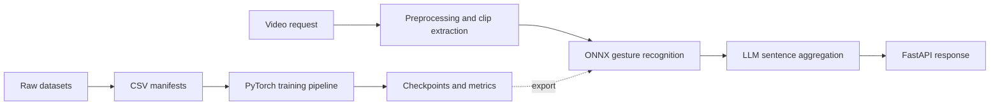

# Russian Sign Language Recognition

> Полный стек распознавания русского жестового языка: FastAPI-сервис для
> обработки видео и сборки фраз, а также воспроизводимый исследовательский
> пайплайн для обучения и сравнения моделей.


Репозиторий объединяет два связанных контура:

- production-контур — HTTP API, ONNX-инференс, preprocessing видео и
  LLM-агрегация распознанных жестов в естественную фразу;
- research-контур — подготовка датасетов, обучение VideoMAE/MViTv2,
  ablation study, cross-lingual transfer и SigLIP2/CLIP-эксперименты.

Исследовательская часть реализована на чистом **PyTorch**, `torchvision`,
Hugging Face `transformers` и `open_clip`, без MMAction2, MMCV, MMEngine и
OpenMIM.

## Возможности

- FastAPI endpoints `/health` и `/recognize`;
- загрузка видео через multipart или Base64 JSON;
- нарезка длинного видео на перекрывающиеся MViTv2-клипы;
- ONNX Runtime для production-инференса;
- агрегация последовательности жестов через local Hugging Face, OpenAI или
  vLLM provider;
- обучение VideoMAE и MViTv2-S для классификации изолированных жестов;
- предобученные Kinetics-400 веса и layer-wise learning-rate decay;
- временные и пространственные аугментации видео;
- MixUp, CutMix, IoU-balanced classification loss и boundary regression;
- подготовка Slovo, WLASL, AUTSL и Kinetics из исходной структуры датасетов;
- signer-independent, random и existing split-стратегии;
- zero-shot и supervised режимы на SigLIP2/CLIP;
- few-shot эксперименты для `k ∈ {1, 2, 4, 8}`;
- автоматическое сохранение checkpoint, метрик, логов и сводной CSV;
- возобновляемые Kaggle-запуски через `.done`-флаги.

## Архитектура



Основной контракт данных — CSV-манифест:

```text
video,label,split,user_id,begin,end,length
/path/to/video.mp4,привет,train,user_01,12,74,96
```

Обязательны `video` и `label`. Остальные поля используются, если доступны:
`split` — для готового разбиения, `user_id` — для signer-independent split,
`begin/end` — для boundary head и IoU-balanced loss.

## Структура проекта

```text
.
├── src/
│   ├── app/main.py             # FastAPI application
│   ├── app/preprocessing/      # video decoding and MViTv2 clip preparation
│   ├── app/services/           # recognition orchestration
│   ├── app/aggregator/         # local/OpenAI/vLLM sentence providers
│   └── slovo_model.py          # ONNX model wrapper
├── islr/                       # библиотека: data, models, losses, training
├── scripts/
│   ├── train.py                # VideoMAE/MViTv2: A, K и C эксперименты
│   ├── train_signvlm.py        # SigLIP2/CLIP: F эксперименты
│   ├── aggregate_results.py    # сбор metrics.json в итоговую таблицу
│   └── data/                   # адаптеры и генераторы CSV-манифестов
├── notebooks/                  # Kaggle workflow в Jupytext и .ipynb
├── reports/                    # данные, графики и скрипты отчётов
├── tests/                      # API preprocessing and research smoke tests
├── requirements.txt
└── pyproject.toml              # настройки Ruff и Pytest
```

## Быстрый старт

### 1. Окружение

```bash
git clone <repository-url>
cd Diploma_claude

python3 -m venv .venv
source .venv/bin/activate
python -m pip install --upgrade pip
python -m pip install -r requirements.txt
```

### Запуск API

Разместите ONNX-модель в локальной директории `models/` и настройте окружение:

```bash
cp .env.example .env
export PYTHONPATH=src
uvicorn app.main:app --host 0.0.0.0 --port 8000
```

Проверка:

```bash
curl http://localhost:8000/health
curl -X POST http://localhost:8000/recognize \
  -F "video=@sample.mp4"
```

JSON-вариант принимает поле `video_base64`. Параметры LLM-провайдера
задаются переменными `NONVERBAL_LLM_*` из `.env.example`.

### Подготовка исследовательского манифеста

Пример для Slovo:

```bash
python scripts/data/prepare_slovo_manifest.py \
  --root /path/to/slovo \
  --output manifests/slovo_raw.csv

python scripts/data/build_sampled_manifest.py \
  --input manifests/slovo_raw.csv \
  --output-dir manifests/slovo100 \
  --dataset-name slovo100 \
  --num-classes 100 \
  --split-mode signer_independent
```

Адаптеры других датасетов:

| Датасет | Скрипт |
|---|---|
| Slovo / RSL | `scripts/data/prepare_slovo_manifest.py` |
| WLASL / ASL | `scripts/data/prepare_wlasl_manifest.py` |
| AUTSL / TSL | `scripts/data/prepare_autsl_manifest.py` |
| Kinetics | `scripts/data/prepare_kinetics_folder_manifest.py` |

Для небольших датасетов или зеркал без готовых `val/test` используйте
`--split-mode random`. Для оценки обобщения между дикторами предпочтителен
`--split-mode signer_independent`.

### Обучение

```bash
python scripts/train.py \
  --train-csv manifests/slovo100/slovo100_train.csv \
  --val-csv manifests/slovo100/slovo100_val.csv \
  --test-csv manifests/slovo100/slovo100_test.csv \
  --label-map manifests/slovo100/slovo100_label_map.csv \
  --model videomae \
  --pretrained k400 \
  --output-dir work_dirs \
  --experiment-id A00_full_pipeline \
  --append-results-to results/all_results.csv \
  --skip-if-done
```

Полный пайплайн по умолчанию включает image/video augmentations, MixUp,
CutMix, boundary head и IoU-balanced loss. Компоненты отключаются отдельными
флагами:

```bash
--no-aug-image
--no-aug-video
--no-boundary-head
--no-iou-loss
--mixup 0
--cutmix 0
```

Для продолжения обучения или transfer learning:

```bash
python scripts/train.py \
  ... \
  --load-from work_dirs/C1_wlasl_step1/best.pt \
  --experiment-id C1_wlasl_then_slovo
```

### SigLIP2 / CLIP

Zero-shot:

```bash
python scripts/train_signvlm.py \
  --mode zero_shot \
  --test-csv manifests/slovo100/slovo100_test.csv \
  --label-map manifests/slovo100/slovo100_label_map.csv \
  --output-dir work_dirs \
  --experiment-id F0_siglip2_zeroshot \
  --prompt "жест {label}"
```

Frozen encoder + temporal decoder:

```bash
python scripts/train_signvlm.py \
  --mode train \
  --train-csv manifests/slovo100/slovo100_train.csv \
  --test-csv manifests/slovo100/slovo100_test.csv \
  --label-map manifests/slovo100/slovo100_label_map.csv \
  --output-dir work_dirs \
  --experiment-id F3_siglip2_full_supervised
```

Чтобы использовать OpenCLIP:

```bash
--vlm-backbone clip --encoder-model ViT-L-14 --clip-pretrained openai
```

## Матрица экспериментов

| Блок | Назначение | Примеры |
|---|---|---|
| A | Ablation study | полный пайплайн и отключение отдельных компонентов |
| K | Влияние Kinetics | без pretrain, K400 sample, K400 → Slovo |
| C | Cross-lingual transfer | WLASL → Slovo, VideoMAE и MViTv2 |
| F | Foundation/VLM | zero-shot, few-shot и full supervised |

Готовые сценарии находятся в:

- `notebooks/01_run_ablation_and_kinetics.py`;
- `notebooks/02_run_crosslingual.py`;
- `notebooks/03_run_signvlm.py`;
- `notebooks/04_results.py`;
- `notebooks/99_persist_results.py`.

Файлы `.py` используют формат Jupytext `py:percent` и могут быть
синхронизированы с Jupyter:

```bash
python -m pip install jupytext
jupytext --sync notebooks/*.py
```

## Результаты запуска

Каждый эксперимент создаёт:

```text
work_dirs/<experiment_id>/
├── best.pt
├── metrics.json
├── train.log
└── <experiment_id>.done
```

Сводная таблица:

```bash
python scripts/aggregate_results.py \
  --inputs work_dirs \
  --master-csv results/all_results.csv \
  --output results/all_summary.csv
```

Ключевые метрики: `top1`, `top5`, `macro_f1` и их тестовые варианты.

## Запуск на Kaggle

Рекомендуемый порядок:

1. Загрузить репозиторий как приватный Kaggle Dataset.
2. Подключить код и исходные датасеты к GPU Notebook.
3. Выполнить `notebooks/00_setup_and_manifests.ipynb`.
4. Сохранить подготовленные manifests как отдельный Kaggle Dataset.
5. Запустить notebooks `01`, `02` и `03` независимо или последовательно.
6. Перед завершением сессии выполнить `99_persist_results.ipynb`.
7. Подключить предыдущий output при следующем запуске.
8. Собрать итоговые таблицы и графики через `04_results.ipynb`.

Артефакты сохраняются в `/kaggle/working`. `.done`-флаги позволяют безопасно
повторно запускать ноутбуки: завершённые эксперименты будут пропущены при
использовании `--skip-if-done`.

## Проверка качества кода

```bash
ruff format --check .
ruff check .
python -m pytest -v
python -m compileall -q islr scripts notebooks reports tests
```

Автоформатирование:

```bash
ruff format .
ruff check --fix .
```

Smoke-тесты не требуют GPU и не скачивают веса моделей.

## Ограничения

- Полноценное обучение video-transformer моделей требует GPU.
- Первый запуск с pretrained-моделями скачивает веса Hugging Face или
  torchvision.
- Чтение видео сначала использует `torchvision.io`, затем OpenCV и `imageio`
  как fallback.
- Реализация не воспроизводит MaskFeat-pretraining из MMAction2; вместо него
  используются доступные supervised Kinetics-400 веса.

## Воспроизводимость

- фиксируйте `--seed` для каждого эксперимента;
- не смешивайте `val` и `test` при подборе параметров;
- для cross-lingual цепочек сохраняйте точный checkpoint первого этапа;
- публикуйте вместе с результатами label map, manifests и `metrics.json`;
- сравнивайте эксперименты по одинаковым split и preprocessing-параметрам.

---

Проект предназначен для исследовательских экспериментов и подготовки
воспроизводимых результатов по isolated sign language recognition.
